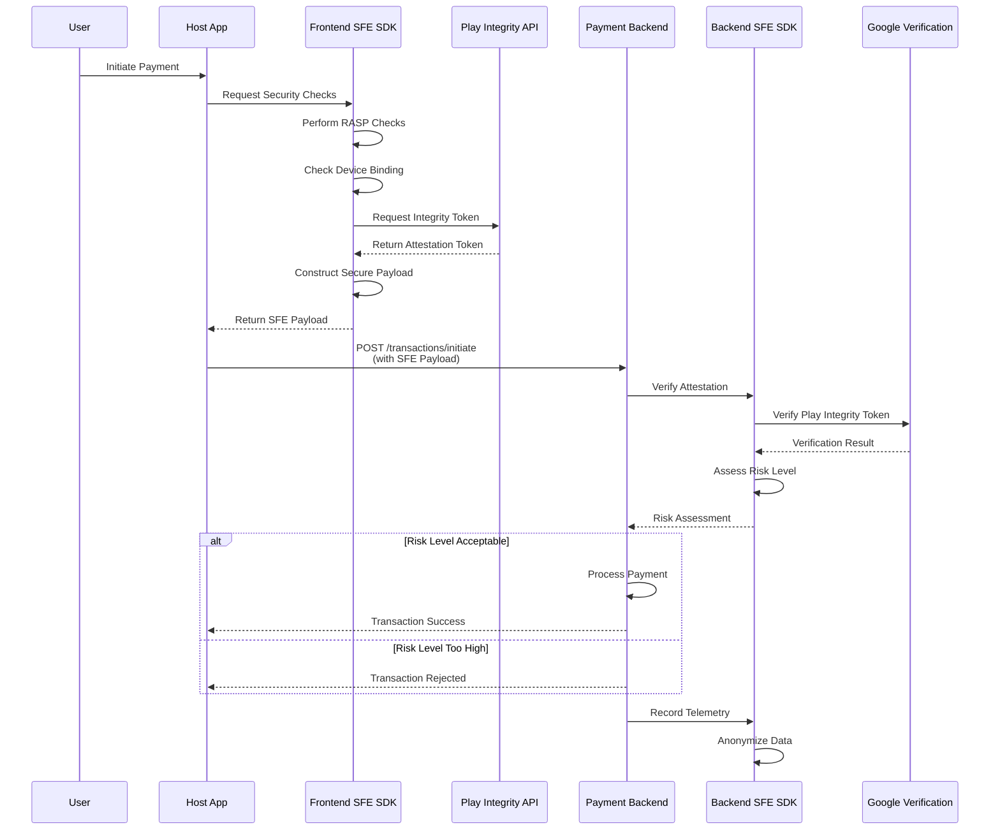

# SFE Ecosystem: Complete Implementation Documentation
```mermaid
graph TB
    subgraph "Regulatory Body Infrastructure"
        subgraph "SDK Development & Maintenance"
            R1[Regulatory Authority<br/>Central Team]
            R2[SFE SDK Repository<br/>GitHub Enterprise]
            R3[CI/CD Pipeline<br/>Automated Testing]
            R4[Security Audit<br/>& Compliance]
            R5[Documentation Portal<br/>Developer Resources]
        end
        
        subgraph "Publication & Distribution"
            P1[Maven Central Repository<br/>Public Distribution]
            P2[Private Maven Repository<br/>Certified Apps Only]
            P3[SDK Portal<br/>Registration & Downloads]
            P4[Certification Process<br/>App Validation]
        end
        
        subgraph "Monitoring & Compliance"
            M1[Telemetry Aggregation<br/>All Apps Data]
            M2[Risk Assessment<br/>Global View]
            M3[Policy Updates<br/>Real-time Push]
            M4[Incident Response<br/>Security Team]
        end
    end
    
    subgraph "Financial App Ecosystem"
        subgraph "Bank Apps"
            B1[Bank A Mobile App]
            B2[Bank B Mobile App]
            B3[Bank C Mobile App]
        end
        
        subgraph "Payment Apps"
            PA1[Payment Provider A]
            PA2[Payment Provider B]
            PA3[Fintech Startups]
        end
        
        subgraph "App Backends"
            AB1[Bank A Backend]
            AB2[Payment Backend]
            AB3[Fintech Backend]
        end
    end
    
    R1 --> R2
    R2 --> R3
    R3 --> R4
    R4 --> P1
    R4 --> P2
    P3 --> P4
    
    P1 --> B1
    P1 --> B2
    P1 --> PA1
    P2 --> B3
    P2 --> PA2
    
    AB1 --> P1
    AB2 --> P1
    AB3 --> P2
    
    B1 -.->|Telemetry| M1
    B2 -.->|Telemetry| M1
    PA1 -.->|Telemetry| M1
    
    M1 --> M2
    M2 --> M3
    M3 -.->|Policy Updates| B1
    M3 -.->|Policy Updates| PA1
    
    style R1 fill:#ff9999
    style P1 fill:#99ff99
    style M1 fill:#9999ff
    ```

**Date:** May 10, 2025  
**Version:** 1.0  
**Team:** Gradient Geeks

## Table of Contents

1. [Introduction and System Overview](#1-introduction-and-system-overview)
2. [System Architecture](#2-system-architecture)
3. [Frontend SFE SDK](#3-frontend-sfe-sdk)
4. [Host Client Application](#4-host-client-application)
5. [Backend SFE SDK](#5-backend-sfe-sdk)
6. [Payment App Backend](#6-payment-app-backend)
7. [End-to-End Data Flow](#7-end-to-end-data-flow)
8. [Implementation Guidelines](#8-implementation-guidelines)
9. [Security Considerations](#9-security-considerations)
10. [Deployment and Integration](#10-deployment-and-integration)

---

## 1. Introduction and System Overview

The Secure Financial Environment (SFE) solution is architected to enhance security in digital payment ecosystems through a multi-component approach. The system provides comprehensive runtime protection, device attestation, and security telemetry for financial applications.

### 1.1 Core Objectives

- **Runtime Application Self-Protection (RASP):** Detect runtime threats and tampering attempts
- **Device Binding:** Ensure transactions originate from trusted, bound devices
- **Device Attestation:** Leverage Google Play Integrity API for device verification
- **Security Telemetry:** Collect and report anonymized security data for regulatory compliance
- **Policy Enforcement:** Apply security policies based on device posture and risk assessment

### 1.2 System Components

The SFE ecosystem comprises four primary, interconnected components:

1. **Frontend SFE SDK** - Android library (AAR) for client-side security
2. **Host Client Application** -  payment app showcasing SDK integration
3. **Backend SFE SDK** - Java/Spring Boot library for server-side security
4. **Payment App Backend** - Server application demonstrating backend SDK usage

---

## 2. System Architecture

### 2.1 Architecture Overview

```mermaid
graph TB
    subgraph "Client Side"
        A[Host Payment App<br/>Java/Android] --> B[Frontend SFE SDK<br/>Kotlin/AAR]
        B --> C[Google Play Integrity API]
        B --> D[Android System Services]
    end
    
    subgraph "Server Side"
        E[Payment App Backend<br/>Java/Spring Boot] --> F[Backend SFE SDK<br/>Java/JAR]
        F --> G[Google Play Integrity Verification]
        F --> H[Policy Engine]
        F --> I[Telemetry Service]
    end
    
    A -.->|HTTPS/JSON| E
    C -.->|Attestation Token| G
    I -.->|Anonymized Data| J[Regulatory Body APIs]
    
    style B fill:#e1f5fe
    style F fill:#f3e5f5
    style A fill:#fff3e0
    style E fill:#e8f5e8
```

### 2.2 Component Relationships

| Component | Type | Language/Framework | Dependencies |
|-----------|------|-------------------|--------------|
| Frontend SFE SDK | Android Library (AAR) | Kotlin | Android SDK, Play Integrity API |
| Host Client App | Android Application | Java | Frontend SFE SDK, AndroidX |
| Backend SFE SDK | Java Library (JAR) | Java/Spring Boot | Spring Framework |
| Payment App Backend | Server Application | Java/Spring Boot | Backend SFE SDK |

---

## 3. Frontend SFE SDK

### 3.1 Overview

The Frontend SFE SDK is a headless Android library that provides robust client-side security intelligence without any UI components.

### 3.2 Core Design Principles

- **Headless Architecture:** No UI components (Activities, Fragments, Views)
- **Clear Public API:** Well-defined, intuitive interface
- **Asynchronous Operations:** Non-blocking operations using Kotlin Coroutines
- **Context Dependency:** Requires Android Context for system service access
- **Modular Design:** Functionality grouped into logical managers
- **Error Handling:** Clear error reporting via Kotlin Result types

### 3.3 SDK Structure

```kotlin
object SfeFrontendSdk {
    data class SdkConfig(
        val legitimateSignatureHash: String,
        val enableDebugLogging: Boolean = false
    )

    // Managers - lazy initialized
    val deviceBindingManager: DeviceBindingManager by lazy { DeviceBindingManagerImpl() }
    val raspManager: RaspManager by lazy { RaspManagerImpl() }
    val attestationManager: AttestationManager by lazy { AttestationManagerImpl() }
    val payloadManager: PayloadManager by lazy { PayloadManagerImpl() }

    @JvmStatic
    fun initialize(context: Context, config: SdkConfig)
    
    @JvmStatic
    fun isInitialized(): Boolean
}
```

### 3.4 Functional Modules

#### 3.4.1 Device Binding Manager

**Purpose:** Verify device and SIM integrity

**Key Methods:**
```kotlin
interface DeviceBindingManager {
    fun isSimPresent(context: Context): Boolean
    fun getNetworkOperator(context: Context): String?
    suspend fun getDeviceBindingToken(context: Context): Result<String>
}
```

**Implementation Details:**
- Checks `TelephonyManager.SIM_STATE_READY`
- Retrieves network operator information
- Generates/retrieves persistent device binding token using Android Keystore
- For prototype: Uses UUID stored in SharedPreferences

#### 3.4.2 RASP Manager

**Purpose:** Runtime Application Self-Protection

**Key Methods:**
```kotlin
interface RaspManager {
    fun isDeviceRooted(): Boolean
    fun isAppTampered(context: Context): Boolean
    fun isDebuggerAttached(): Boolean
}
```

**Detection Mechanisms:**
- **Root Detection:** Checks for su binaries, root management apps, test-keys in Build.TAGS
- **Tamper Detection:** Compares current app signature with legitimate hash
- **Debugger Detection:** Monitors Debug.isDebuggerConnected(), TracerPid in /proc/self/status

#### 3.4.3 Attestation Manager

**Purpose:** Google Play Integrity API integration

**Key Methods:**
```kotlin
interface AttestationManager {
    suspend fun requestPlayIntegrityToken(context: Context, nonce: String): Result<String>
}
```

**Implementation:**
- Integrates with `IntegrityManagerFactory`
- Handles cryptographic nonce validation
- Returns attestation tokens for server-side verification

#### 3.4.4 Payload Manager

**Purpose:** Secure data payload construction

**Key Methods:**
```kotlin
interface PayloadManager {
    suspend fun constructSecurePayload(context: Context, attestationToken: String?): Result<String>
}
```

**Payload Structure:**
```json
{
    "appVersion": "1.0.0",
    "sdkVersion": "1.2.0-prototype",
    "timestamp": "2025-05-10T12:00:00Z",
    "deviceInfo": {
        "osVersion": "14",
        "deviceModel": "Pixel 8",
        "isRooted": false,
        "isDebuggerAttached": false,
        "isAppTampered": false
    },
    "bindingInfo": {
        "simPresent": true,
        "networkOperator": "Verizon",
        "deviceBindingToken": "uuid-token"
    },
    "attestationToken": "encrypted-play-integrity-token"
}
```

### 3.5 Required Permissions

The host application must declare:

```xml
<uses-permission android:name="android.permission.INTERNET" />
<uses-permission android:name="android.permission.ACCESS_NETWORK_STATE" />
<!-- Optional: android.permission.READ_PHONE_STATE for enhanced telephony info -->
```

### 3.6 ProGuard/R8 Configuration

```proguard
# Keep the main SDK entry point
-keep class com.gradientgeeks.sfesdk.SfeFrontendSdk { *; }
-keepclassmembers class com.gradientgeeks.sfesdk.SfeFrontendSdk {
    public static ** Companion;
}
-keep class com.gradientgeeks.sfesdk.SfeFrontendSdk$SdkConfig { *; }

# Keep public interfaces
-keep interface com.gradientgeeks.sfesdk.**Manager { *; }

# Kotlin coroutines support
-dontwarn kotlinx.coroutines.**
-keepattributes Signature, InnerClasses, EnclosingMethod
```

---

## 4. Host Client Application

### 4.1 Overview

The Host Client Application is an Android Java application that demonstrates SFE SDK integration and simulates a payment application's functionality.

### 4.2 Project Configuration

**Technology Stack:**
- **Language:** Java
- **Platform:** Android
- **Build System:** Gradle
- **Minimum SDK:** API 24+

**Key Dependencies:**
```gradle
dependencies {
    // AndroidX Libraries
    implementation 'androidx.appcompat:appcompat:1.6.1'
    implementation 'com.google.android.material:material:1.9.0'
    implementation 'androidx.constraintlayout:constraintlayout:2.1.4'
    implementation 'androidx.lifecycle:lifecycle-viewmodel:2.6.2'
    implementation 'androidx.lifecycle:lifecycle-livedata:2.6.2'
    
    // Kotlin Coroutines (for SDK interop)
    implementation 'org.jetbrains.kotlinx:kotlinx-coroutines-core:1.7.3'
    implementation 'org.jetbrains.kotlinx:kotlinx-coroutines-android:1.7.3'
    
    // SFE SDK
    implementation files('libs/sfe-frontend-sdk.aar')
    
    // Optional: HTTP client
    implementation 'com.squareup.retrofit2:retrofit:2.9.0'
    implementation 'com.squareup.retrofit2:converter-gson:2.9.0'
}
```

### 4.3 Application Structure

#### 4.3.1 Application Class

```java
public class HostApplication extends Application {
    private static final String YOUR_APP_SIGNATURE_HASH = "SHA256_HASH_HERE";
    
    @Override
    public void onCreate() {
        super.onCreate();
        
        SdkConfig sdkConfig = new SdkConfig(
            YOUR_APP_SIGNATURE_HASH,
            BuildConfig.DEBUG
        );
        
        SfeFrontendSdk.Companion.initialize(getApplicationContext(), sdkConfig);
    }
}
```

#### 4.3.2 MainActivity

```java
public class MainActivity extends AppCompatActivity {
    private MainViewModel mainViewModel;
    private TextView tvResultsLog;
    
    @Override
    protected void onCreate(Bundle savedInstanceState) {
        super.onCreate(savedInstanceState);
        setContentView(R.layout.activity_main);
        
        mainViewModel = new ViewModelProvider(this).get(MainViewModel.class);
        setupUI();
        observeViewModel();
    }
    
    private void setupUI() {
        // Initialize buttons for:
        // - Device binding checks
        // - RASP checks
        // - Play Integrity token request
        // - Payload construction
        // - Backend communication
    }
}
```

#### 4.3.3 MainViewModel

```java
public class MainViewModel extends ViewModel {
    private final MutableLiveData<String> _logMessages = new MutableLiveData<>();
    private final MutableLiveData<String> _deviceBindingToken = new MutableLiveData<>();
    private final MutableLiveData<String> _playIntegrityToken = new MutableLiveData<>();
    private final MutableLiveData<String> _securePayload = new MutableLiveData<>();
    
    // SDK Manager references
    private DeviceBindingManager deviceBindingManager = 
        SfeFrontendSdk.Companion.getDeviceBindingManager();
    private RaspManager raspManager = 
        SfeFrontendSdk.Companion.getRaspManager();
    // ... other managers
    
    public void performSecurityChecks(Context context) {
        // Coordinate SDK calls using ViewModelScope
    }
}
```

### 4.4 User Interface

**Main Screen Components:**
- **Action Buttons:**
  - Initialize & Check SDK
  - Get Device Binding Info
  - Check Root Status
  - Check App Tamper
  - Check Debugger Attached
  - Get Play Integrity Token
  - Construct Secure Payload
  - Send Payload to Backend

- **Display Areas:**
  - Scrollable log TextView for operation results
  - Status indicators for each security check

### 4.5 SDK Integration Patterns

#### 4.5.1 Calling Suspend Functions from Java

```java
// Pattern for calling Kotlin suspend functions from Java ViewModel
public void fetchDeviceBindingToken(Context context) {
    BuildersKt.launch(viewModelScope, Dispatchers.getIO(), 
        kotlinx.coroutines.CoroutineStart.DEFAULT, (scope, continuation) -> {
            try {
                Result<String> result = BuildersKt.runBlocking(
                    Dispatchers.getIO(), 
                    (s, c) -> deviceBindingManager.getDeviceBindingToken(context, c)
                );
                
                if (result.isSuccess()) {
                    _deviceBindingToken.postValue(result.getOrNull());
                } else {
                    _logMessages.postValue("Error: " + result.exceptionOrNull().getMessage());
                }
            } catch (Exception e) {
                _logMessages.postValue("Exception: " + e.getMessage());
            }
            return Unit.INSTANCE;
        });
}
```

#### 4.5.2 Backend Communication

```java
public void sendPayloadToBackend(String payload) {
    // Construct HTTP request with payload
    // Include authentication headers
    // Handle response and update UI
}
```

---

## 5. Backend SFE SDK

### 5.1 Overview

The Backend SFE SDK is a Java/Spring Boot library providing server-side security logic for integration into payment provider backends.

### 5.2 Architecture

**Package Structure:**
```
com.gradientgeeks.sfe.backend.sdk
├── config/
│   ├── SfeBackendSdkConfig.java
│   └── SfeAutoConfiguration.java
├── services/
│   ├── AttestationVerificationService.java
│   ├── PolicyEnforcementService.java
│   └── TelemetryService.java
├── models/
│   ├── AttestationRequest.java
│   ├── AttestationResponse.java
│   └── TelemetryEventRequest.java
└── utils/
    └── SecurityUtils.java
```

### 5.3 Core Services

#### 5.3.1 Attestation Verification Service

```java
@Service
public class AttestationVerificationService {
    
    public AttestationResponse verifyAttestation(AttestationRequest request) {
        // Extract Play Integrity token
        // Verify token with Google's servers
        // Parse integrity verdicts
        // Return verification results
    }
    
    private IntegrityVerdicts parseIntegrityToken(String token) {
        // Token parsing and verification logic
    }
}
```

#### 5.3.2 Policy Enforcement Service

```java
@Service
public class PolicyEnforcementService {
    
    public String assessRisk(AttestationRequest frontendData, 
                           AttestationResponse attestationResult) {
        // Apply security policies
        // Calculate risk score
        // Return risk level: LOW, MEDIUM, HIGH, CRITICAL
    }
    
    private boolean isHighRiskDevice(AttestationRequest request) {
        return request.getDeviceInfo().isRooted() || 
               request.getDeviceInfo().isAppTampered() ||
               request.getDeviceInfo().isDebuggerAttached();
    }
}
```

#### 5.3.3 Telemetry Service

```java
@Service
public class TelemetryService {
    
    public void recordTelemetry(TelemetryEventRequest telemetryRequest) {
        // Process anonymized security events
        // Store in database or forward to regulatory APIs
        // Handle batch processing
    }
    
    public void submitToRegulatoryBody(List<TelemetryEvent> events) {
        // Format for regulatory submission
        // Ensure anonymization and privacy compliance
    }
}
```

### 5.4 Data Models

#### 5.4.1 AttestationRequest

```java
public class AttestationRequest {
    private String appVersion;
    private String sdkVersion;
    private String timestamp;
    private DeviceInfo deviceInfo;
    private BindingInfo bindingInfo;
    private String attestationToken;
    
    // Getters, setters, constructors
}

public class DeviceInfo {
    private String osVersion;
    private String deviceModel;
    private boolean isRooted;
    private boolean isDebuggerAttached;
    private boolean isAppTampered;
}

public class BindingInfo {
    private boolean simPresent;
    private String networkOperator;
    private String deviceBindingToken;
}
```

#### 5.4.2 AttestationResponse

```java
public class AttestationResponse {
    private String status;
    private String message;
    private IntegrityVerdicts integrityVerdicts;
    private long timestamp;
    
    public static class IntegrityVerdicts {
        private boolean meetsDeviceIntegrity;
        private boolean meetsBasicIntegrity;
        private String appIntegrityVerdict;
    }
}
```

### 5.5 Configuration

```java
@ConfigurationProperties(prefix = "sfe.backend.sdk")
public class SfeBackendSdkConfig {
    private String googleCloudProjectId;
    private String playIntegrityApiKey;
    private boolean enableTelemetry = true;
    private String regulatoryApiEndpoint;
    
    // Configuration properties
}
```

---

## 6. Payment App Backend

### 6.1 Overview

The Payment App Backend is a Spring Boot application demonstrating integration of the Backend SFE SDK in a payment processing system.

### 6.2 API Endpoints

#### 6.2.1 Authentication Endpoint

```java
@RestController
@RequestMapping("/payment-app/api/v1/auth")
public class AuthenticationController {
    
    @PostMapping("/login")
    public ResponseEntity<LoginResponse> login(@RequestBody LoginRequest request) {
        // Validate credentials
        // Generate mock session token
        // Return authentication result
    }
}
```

#### 6.2.2 Transaction Endpoint

```java
@RestController
@RequestMapping("/payment-app/api/v1/transactions")
public class TransactionController {
    
    @Autowired
    private PaymentProcessingService paymentService;
    
    @PostMapping("/initiate")
    public ResponseEntity<TransactionResponse> initiateTransaction(
            @RequestHeader("X-Auth-Token") String authToken,
            @RequestBody InitiateTransactionRequest request) {
        
        // Validate session token
        // Extract SFE payload
        // Process with SFE Backend SDK
        // Make transaction decision
        // Return result
    }
}
```

### 6.3 Payment Processing Service

```java
@Service
public class PaymentProcessingService {
    
    @Autowired
    private AttestationVerificationService attestationService;
    
    @Autowired
    private PolicyEnforcementService policyService;
    
    @Autowired
    private TelemetryService telemetryService;
    
    public TransactionResponse processPayment(InitiateTransactionRequest request) {
        // Map SFE payload to AttestationRequest
        AttestationRequest attestationRequest = mapSfePayload(request.getSfePayload());
        
        // Verify attestation
        AttestationResponse attestationResponse = 
            attestationService.verifyAttestation(attestationRequest);
        
        // Assess risk
        String riskLevel = policyService.assessRisk(attestationRequest, attestationResponse);
        
        // Make decision based on risk
        if ("HIGH".equals(riskLevel) || "CRITICAL".equals(riskLevel)) {
            return TransactionResponse.rejected("Security concerns detected");
        }
        
        // Record telemetry
        telemetryService.recordTelemetry(createTelemetryEvent(attestationRequest));
        
        // Process payment
        return processActualPayment(request);
    }
}
```

### 6.4 Security Configuration

```java
@Configuration
@EnableWebSecurity
public class SecurityConfig {
    
    @Bean
    public SecurityFilterChain filterChain(HttpSecurity http) throws Exception {
        http
            .authorizeHttpRequests(authz -> authz
                .requestMatchers("/payment-app/api/v1/auth/**").permitAll()
                .requestMatchers("/payment-app/api/v1/transactions/**").authenticated()
                .anyRequest().denyAll()
            )
            .sessionManagement(session -> session
                .sessionCreationPolicy(SessionCreationPolicy.STATELESS)
            );
        
        return http.build();
    }
}
```

---

## 7. End-to-End Data Flow

### 7.1 Complete Transaction Flow



### 7.2 Data Transformations

#### 7.2.1 Frontend Payload Generation

```kotlin
// Frontend SFE SDK generates:
val sfePayload = """
{
    "appVersion": "1.0.0",
    "sdkVersion": "1.2.0",
    "timestamp": "2025-05-10T12:00:00Z",
    "deviceInfo": {
        "osVersion": "14",
        "isRooted": false,
        "isDebuggerAttached": false,
        "isAppTampered": false
    },
    "bindingInfo": {
        "simPresent": true,
        "networkOperator": "Verizon",
        "deviceBindingToken": "uuid-123"
    },
    "attestationToken": "encrypted-token"
}
"""
```

#### 7.2.2 Backend Processing

```java
// Backend SFE SDK processes:
AttestationRequest request = mapFromJson(sfePayload);
AttestationResponse response = verifyAttestation(request);
String riskLevel = assessRisk(request, response);

// Decision logic:
if ("CRITICAL".equals(riskLevel)) {
    return reject("Critical security threat detected");
} else if ("HIGH".equals(riskLevel)) {
    return requireAdditionalAuth("Enhanced verification required");
} else {
    return proceed("Security checks passed");
}
```

---

## 8. Implementation Guidelines

### 8.1 Development Setup

#### 8.1.1 Frontend SDK Development

```bash
# Android SDK project structure
sfe-client-sdk/
├── src/main/kotlin/
│   └── com/gradientgeeks/sfesdk/
│       ├── SfeFrontendSdk.kt
│       ├── managers/
│       └── models/
├── src/test/kotlin/
├── build.gradle.kts
└── proguard-rules.pro
```

**Build Configuration:**
```kotlin
// build.gradle.kts
android {
    compileSdk = 34
    
    defaultConfig {
        minSdk = 24
        consumerProguardFiles("consumer-rules.pro")
    }
    
    buildTypes {
        release {
            isMinifyEnabled = false
            proguardFiles(getDefaultProguardFile("proguard-android-optimize.txt"))
        }
    }
}

dependencies {
    implementation("org.jetbrains.kotlinx:kotlinx-coroutines-android:1.7.3")
    implementation("com.google.android.play:integrity:1.3.0")
    implementation("org.jetbrains.kotlinx:kotlinx-coroutines-play-services:1.7.3")
}
```

#### 8.1.2 Backend SDK Development

```bash
# Spring Boot library structure
sfe-server-sdk/
├── src/main/java/
│   └── com/gradientgeeks/sfe/backend/
│       ├── config/
│       ├── services/
│       └── models/
├── src/test/java/
└── pom.xml
```

**Maven Configuration:**
```xml
<dependencies>
    <dependency>
        <groupId>org.springframework.boot</groupId>
        <artifactId>spring-boot-starter</artifactId>
    </dependency>
    <dependency>
        <groupId>com.google.api-client</groupId>
        <artifactId>google-api-client</artifactId>
    </dependency>
</dependencies>
```

### 8.2 Testing Strategy

#### 8.2.1 Frontend SDK Testing

```kotlin
@Test
fun `device binding token generation should be consistent`() = runTest {
    val context = mockContext()
    val manager = DeviceBindingManagerImpl()
    
    val token1 = manager.getDeviceBindingToken(context).getOrThrow()
    val token2 = manager.getDeviceBindingToken(context).getOrThrow()
    
    assertEquals(token1, token2)
}

@Test
fun `RASP checks should detect rooted device`() {
    val manager = RaspManagerImpl()
    // Mock root indicators
    val result = manager.isDeviceRooted()
    // Assert based on test environment
}
```

#### 8.2.2 Backend SDK Testing

```java
@Test
public void testRiskAssessment() {
    AttestationRequest request = createMockRequest(true, false, false); // rooted
    AttestationResponse response = createMockResponse(false, false);
    
    String riskLevel = policyService.assessRisk(request, response);
    
    assertEquals("HIGH", riskLevel);
}
```

### 8.3 Integration Patterns

#### 8.3.1 SDK Initialization Best Practices

```java
// Host Application - Recommended pattern
public class PaymentApplication extends Application {
    @Override
    public void onCreate() {
        super.onCreate();
        
        // Initialize SFE SDK early
        initializeSfeSDK();
        
        // Other app initializations
    }
    
    private void initializeSfeSDK() {
        String signatureHash = getSignatureHash();
        SdkConfig config = new SdkConfig(signatureHash, BuildConfig.DEBUG);
        SfeFrontendSdk.Companion.initialize(this, config);
    }
}
```

#### 8.3.2 Error Handling Patterns

```kotlin
// Frontend SDK - Consistent error handling
suspend fun getDeviceBindingToken(context: Context): Result<String> {
    return try {
        val token = generateOrRetrieveToken(context)
        Result.success(token)
    } catch (e: SecurityException) {
        logError("Security exception in device binding", e)
        Result.failure(SfeSecurityException("Device binding failed", e))
    } catch (e: Exception) {
        logError("Unexpected error in device binding", e)
        Result.failure(SfeException("Device binding operation failed", e))
    }
}
```

---

## 9. Security Considerations

### 9.1 Frontend Security

#### 9.1.1 Data Protection

- **Sensitive Data Handling:** Minimize storage of sensitive information
- **Keystore Usage:** Leverage Android Keystore for cryptographic operations
- **Obfuscation:** Apply proper ProGuard/R8 rules
- **Runtime Protection:** Implement anti-tampering measures

#### 9.1.2 Communication Security

- **Certificate Pinning:** Implement for backend communication
- **Request Integrity:** Sign or encrypt sensitive payloads
- **Replay Protection:** Use nonces and timestamps

### 9.2 Backend Security

#### 9.2.1 Token Verification

```java
@Service
public class IntegrityTokenVerifier {
    
    public boolean verifyToken(String token, String nonce) {
        try {
            // Decrypt and verify token with Google
            IntegrityTokenResponse response = decryptAndVerify(token);
            
            // Validate nonce
            if (!nonce.equals(response.getRequestDetails().getNonce())) {
                return false;
            }
            
            // Check integrity verdicts
            return response.getDeviceIntegrity().getMeetsDeviceIntegrity();
            
        } catch (Exception e) {
            log.error("Token verification failed", e);
            return false;
        }
    }
}
```

#### 9.2.2 Policy Configuration

```yaml
# application.yml
sfe:
  backend:
    sdk:
      policies:
        root-detection:
          action: REJECT
          risk-level: HIGH
        debugger-detection:
          action: WARN
          risk-level: MEDIUM
        app-tampering:
          action: REJECT
          risk-level: CRITICAL
```

### 9.3 Privacy and Compliance

#### 9.3.1 Data Anonymization

```java
public class TelemetryAnonymizer {
    
    public AnonymizedEvent anonymize(SecurityEvent event) {
        return AnonymizedEvent.builder()
            .eventType(event.getType())
            .timestamp(truncateToHour(event.getTimestamp()))
            .deviceFingerprint(hashDeviceId(event.getDeviceId()))
            .riskLevel(event.getRiskLevel())
            .build();
    }
    
    private String hashDeviceId(String deviceId) {
        return DigestUtils.sha256Hex(deviceId + SALT);
    }
}
```

#### 9.3.2 Regulatory Reporting

```java
@Service
public class RegulatoryReportingService {
    
    @Scheduled(cron = "0 0 1 * * ?") // Daily at 1 AM
    public void generateDailyReport() {
        List<AnonymizedEvent> events = telemetryService.getEventsForLastDay();
        ComplianceReport report = buildComplianceReport(events);
        submitToRegulatoryBody(report);
    }
}
```

---

## 10. Deployment and Integration

### 10.1 Packaging and Distribution

#### 10.1.1 Frontend SDK Distribution

```bash
# Build AAR for distribution
./gradlew assembleRelease

# Output: sfe-client-sdk/build/outputs/aar/sfe-frontend-sdk-release.aar
```

#### 10.1.2 Backend SDK Distribution

```bash
# Build JAR for distribution
mvn clean package

# Output: target/sfe-backend-sdk-1.0.0.jar
```

### 10.2 Integration Checklist

#### 10.2.1 Host Application Integration

- [ ] Add SFE SDK AAR dependency
- [ ] Configure ProGuard rules
- [ ] Initialize SDK in Application class
- [ ] Implement proper error handling
- [ ] Request necessary permissions
- [ ] Test on various device configurations

#### 10.2.2 Backend Integration

- [ ] Add Backend SFE SDK dependency
- [ ] Configure Spring Boot auto-configuration
- [ ] Set up Google Play Integrity verification
- [ ] Implement security policies
- [ ] Configure telemetry collection
- [ ] Set up regulatory reporting

### 10.3 Monitoring and Maintenance

#### 10.3.1 Performance Monitoring

```java
@Component
public class SfePerformanceMonitor {
    
    @EventListener
    public void onAttestationRequest(AttestationRequestEvent event) {
        Timer.Sample sample = Timer.start(meterRegistry);
        // ... processing
        sample.stop("sfe.attestation.duration");
    }
}
```

#### 10.3.2 Health Checks

```java
@Component
public class SfeHealthIndicator implements HealthIndicator {
    
    @Override
    public Health health() {
        if (isGooglePlayIntegrityAvailable() && isPolicyEngineHealthy()) {
            return Health.up()
                .withDetail("play-integrity", "available")
                .withDetail("policy-engine", "healthy")
                .build();
        }
        return Health.down()
            .withDetail("status", "degraded")
            .build();
    }
}
```

---

## Conclusion

The SFE Ecosystem provides a comprehensive security framework for financial applications through:

1. **Client-side Protection:** Runtime security monitoring and device attestation
2. **Server-side Verification:** Token validation and policy enforcement
3. **Compliance Support:** Automated telemetry collection and regulatory reporting
4. **Developer-Friendly:** Clear APIs and integration patterns

This documentation serves as the foundation for implementing and deploying the SFE solution in production financial systems.

---

**Document Version:** 1.0  
**Last Updated:** May 10, 2025  
**Next Review:** June 10, 2025 