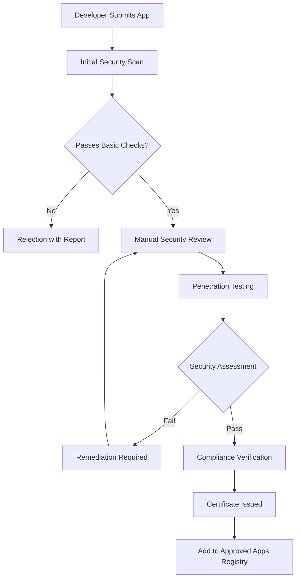

# SFE SDK Regulatory Distribution Plan

## Executive Summary

This document outlines how a financial regulatory body can maintain, certify, and distribute the Secure Financial Environment (SFE) SDKs to ensure standardized security across all financial applications in their jurisdiction.

## 1. Regulatory Framework Structure

### 1.1 Centralized Maintenance Model

```
Financial Regulatory Authority (FRA)
├── SFE Security Standards Division
│   ├── SDK Development Team
│   ├── Security Research Team
│   ├── Compliance Monitoring Team
│   └── Technical Support Team
├── Certification & Distribution
│   ├── App Certification Process
│   ├── SDK Version Management
│   └── Developer Relations
└── Monitoring & Enforcement
    ├── Real-time Threat Detection
    ├── Incident Response Team
    └── Policy Updates Distribution
```

### 1.2 Legal Framework Requirements

**Mandatory Integration**: All financial apps must integrate certified SFE SDKs
**Compliance Standards**: Apps must pass security certification before market release
**Regular Updates**: Apps must implement SDK updates within regulated timeframes
**Data Reporting**: Anonymized security telemetry must be shared with regulatory body

## 2. SDK Maintenance Infrastructure

### 2.1 Development Environment

```yaml
# Regulatory Body Infrastructure
infrastructure:
  source_control:
    primary: "GitHub Enterprise (Private)"
    mirror: "GitLab Enterprise (Backup)"
    
  ci_cd:
    platform: "Jenkins/GitHub Actions"
    security_scanning: "SonarQube, Snyk, Veracode"
    automated_testing: "Unit, Integration, Security Tests"
    
  artifact_repository:
    public: "Maven Central Repository"
    private: "Nexus Repository Manager"
    certification_required: true
    
  monitoring:
    telemetry_aggregation: "Apache Kafka + Apache Spark"
    real_time_analytics: "Elastic Stack"
    dashboard: "Grafana + Custom Regulatory Dashboard"
```

### 2.2 Version Management Strategy

```
SDK Versioning Schema: MAJOR.MINOR.PATCH-REGULATORY_VERSION

Examples:
- 2.1.0-FRA001: Major release with new security features
- 2.1.1-FRA002: Security patch release
- 2.2.0-FRA003: Minor feature update

Release Cycle:
- Major releases: Quarterly (with 6-month adoption window)
- Security patches: As needed (with 30-day mandatory adoption)
- Minor updates: Monthly (with 3-month adoption window)
```

## 3. Distribution Mechanisms

### 3.1 Public SDK Distribution

#### Maven Central Repository Configuration

```gradle
// For financial apps to integrate
dependencies {
    // Frontend SDK
    implementation 'org.financialregulator.sfe:sfe-frontend-sdk:2.1.0-FRA001'
    
    // Backend SDK
    implementation 'org.financialregulator.sfe:sfe-backend-sdk:2.1.0-FRA001'
}

repositories {
    mavenCentral()
    // Optional: Regulatory body's certified repository
    maven {
        url "https://sdk.financialregulator.gov/repository"
        credentials {
            username = project.findProperty("sfe.username")
            password = project.findProperty("sfe.password")
        }
    }
}
```

### 3.2 Certification Portal

#### Developer Registration System

```typescript
// SDK Portal API Structure
interface DeveloperRegistration {
  organizationName: string;
  financialLicense: string;
  contactEmail: string;
  technicalContact: {
    name: string;
    email: string;
    phone: string;
  };
  applicationDetails: {
    appName: string;
    packageId: string;
    appType: 'BANKING' | 'PAYMENT' | 'FINTECH' | 'CRYPTO';
  };
}

interface CertificationRequest {
  appPackageId: string;
  sdkVersion: string;
  securityAssessmentReport: File;
  penetrationTestResults: File;
  privacyPolicyDocument: File;
}
```

### 3.3 Tiered Access Model

#### Access Levels

```yaml
access_tiers:
  tier_1_public:
    description: "Basic SFE SDK for general financial apps"
    sdk_features:
      - Basic RASP protection
      - Standard device attestation
      - Public telemetry reporting
    approval_required: false
    
  tier_2_certified:
    description: "Enhanced SDK for certified financial institutions"
    sdk_features:
      - Advanced threat detection
      - Real-time policy updates
      - Priority support
      - Custom security policies
    approval_required: true
    requirements:
      - Valid banking license
      - Security audit completion
      - Compliance certification
      
  tier_3_critical:
    description: "Maximum security for central banking systems"
    sdk_features:
      - All Tier 2 features
      - Custom security modules
      - Dedicated support team
      - Real-time incident response
    approval_required: true
    requirements:
      - Central bank authorization
      - Government security clearance
      - On-premise deployment support
```

## 4. Compliance and Certification Process

### 4.1 App Certification Workflow



### 4.2 Ongoing Compliance Monitoring

```java
// Regulatory Monitoring Service
@Service
public class ComplianceMonitoringService {
    
    @Scheduled(fixedRate = 300000) // Every 5 minutes
    public void monitorAppCompliance() {
        List<RegisteredApp> apps = appRegistry.getAllRegisteredApps();
        
        for (RegisteredApp app : apps) {
            ComplianceStatus status = assessCompliance(app);
            
            if (status.isNonCompliant()) {
                triggerComplianceAction(app, status);
            }
            
            // Update real-time dashboard
            complianceDashboard.updateAppStatus(app.getPackageId(), status);
        }
    }
    
    private void triggerComplianceAction(RegisteredApp app, ComplianceStatus status) {
        switch (status.getSeverity()) {
            case CRITICAL:
                revokeAppCertificate(app);
                notifyAppStores(app, "IMMEDIATE_REMOVAL_REQUIRED");
                break;
            case HIGH:
                suspendAppCertificate(app);
                notifyDeveloper(app, "COMPLIANCE_BREACH_HIGH");
                break;
            case MEDIUM:
                flagForReview(app);
                notifyDeveloper(app, "COMPLIANCE_WARNING");
                break;
        }
    }
}
```

## 5. Technical Implementation Details

### 5.1 SDK Configuration for Regulatory Use

#### Enhanced Backend Configuration

```yaml
# application.yml for regulatory-grade deployment
sfe:
  regulatory:
    authority_id: "FRA-2024"
    reporting_endpoint: "https://telemetry.financialregulator.gov/api/v1/events"
    policy_server: "https://policies.financialregulator.gov/api/v1"
    
  backend:
    sdk:
      # Enhanced security policies
      policies:
        mandatory_attestation: true
        device_binding_required: true
        root_detection:
          action: "REJECT"
          risk_level: "CRITICAL"
        debugger_detection:
          action: "REJECT"
          risk_level: "HIGH"
        app_tampering:
          action: "REJECT"
          risk_level: "CRITICAL"
        
      # Regulatory telemetry
      telemetry:
        enable_regulatory_reporting: true
        batch_size: 1000
        batch_timeout_ms: 30000
        encryption_required: true
        anonymization_level: "FULL"
        
      # Real-time policy updates
      policy_updates:
        enable_real_time: true
        update_check_interval_ms: 60000
        auto_apply_critical_updates: true
```

### 5.2 Mandatory Integration Requirements

#### Frontend SDK Integration Checklist

```kotlin
// Mandatory initialization in Application class
class FinancialApp : Application() {
    override fun onCreate() {
        super.onCreate()
        
        // MANDATORY: Initialize SFE SDK with regulatory configuration
        val config = SfeFrontendSdk.SdkConfig(
            legitimateSignatureHash = BuildConfig.APP_SIGNATURE_HASH,
            enableDebugLogging = BuildConfig.DEBUG,
            regulatoryAuthorityId = "FRA-2024", // REQUIRED
            complianceMode = true // REQUIRED for financial apps
        )
        
        SfeFrontendSdk.initialize(this, config)
        
        // MANDATORY: Register compliance callbacks
        SfeFrontendSdk.setComplianceCallback(object : ComplianceCallback {
            override fun onPolicyViolation(violation: PolicyViolation) {
                // Handle policy violations according to regulatory requirements
                handleRegulatoryViolation(violation)
            }
            
            override fun onSecurityThreat(threat: SecurityThreat) {
                // Report security threats to regulatory body
                reportSecurityIncident(threat)
            }
        })
    }
}
```

## 6. Developer Ecosystem Support

### 6.1 Documentation Portal

```
Financial Regulatory Authority SDK Portal
├── Getting Started Guide
├── Integration Documentation
├── Security Best Practices
├── Compliance Requirements
├── API Reference
├── Sample Applications
├── Testing Guidelines
├── Certification Process
└── Support Resources
```

### 6.2 Developer Support Services

#### Technical Support Tiers

```yaml
support_tiers:
  community:
    channels: ["Documentation", "FAQs", "Community Forum"]
    response_time: "Best effort"
    cost: "Free"
    
  standard:
    channels: ["Email Support", "Knowledge Base"]
    response_time: "48 hours"
    cost: "Included with certification"
    
  premium:
    channels: ["Phone Support", "Dedicated Engineer", "Priority Email"]
    response_time: "4 hours"
    cost: "Premium subscription"
    
  enterprise:
    channels: ["24/7 Support", "On-site Assistance", "Custom Development"]
    response_time: "1 hour"
    cost: "Enterprise contract"
```

## 7. Implementation Roadmap

### Phase 1: Foundation (Months 1-3)
- [ ] Establish regulatory infrastructure
- [ ] Create SDK certification process
- [ ] Set up Maven repositories
- [ ] Develop compliance monitoring system

### Phase 2: Pilot Program (Months 4-6)
- [ ] Onboard 5-10 major financial institutions
- [ ] Implement telemetry collection
- [ ] Refine certification process
- [ ] Establish support procedures

### Phase 3: Full Deployment (Months 7-12)
- [ ] Mandatory adoption for all financial apps
- [ ] Real-time threat detection
- [ ] Advanced analytics dashboard
- [ ] International cooperation frameworks

### Phase 4: Evolution (Year 2+)
- [ ] AI-powered threat detection
- [ ] Cross-border compliance support
- [ ] Blockchain integration
- [ ] Quantum-safe cryptography

## 8. Governance and Oversight

### 8.1 Advisory Committee Structure

```
SFE Technical Advisory Committee
├── Financial Institution Representatives (40%)
├── Technology Industry Experts (25%)
├── Cybersecurity Specialists (20%)
├── Privacy Advocates (10%)
└── Academic Researchers (5%)
```

### 8.2 Decision Making Process

**Technical Updates**: SDK development team with advisory committee review
**Policy Changes**: Regulatory body with industry consultation
**Security Incidents**: Immediate response team with post-incident analysis
**Compliance Actions**: Legal team with technical assessment support

## 9. Success Metrics

### 9.1 Key Performance Indicators

```yaml
security_metrics:
  threat_detection_rate: ">95%"
  false_positive_rate: "<2%"
  incident_response_time: "<1 hour"
  
compliance_metrics:
  app_certification_rate: ">90%"
  sdk_adoption_rate: "100% (mandatory)"
  policy_update_compliance: ">98%"
  
ecosystem_metrics:
  developer_satisfaction: ">4.5/5"
  integration_success_rate: ">95%"
  support_response_time: "<4 hours"
```

## 10. Conclusion

This regulatory distribution model ensures:

1. **Standardized Security**: All financial apps use the same proven security framework
2. **Centralized Monitoring**: Real-time visibility into the financial app ecosystem
3. **Rapid Response**: Quick deployment of security updates across all apps
4. **Developer Support**: Comprehensive resources for successful integration
5. **Compliance Assurance**: Automated monitoring and enforcement of security policies

The SFE SDK ecosystem becomes a critical infrastructure component, similar to how regulatory bodies manage banking networks, ensuring the security and integrity of the entire digital financial ecosystem. 